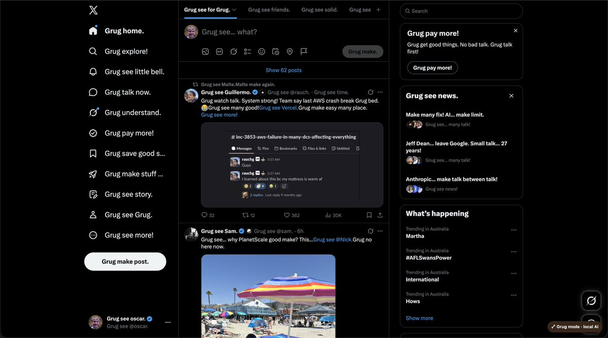

# Grug Talk

Grug make X posts talk simple. Grug use Chrome brain when Chrome have brain. No post go to far-away server.

## Grug do this

- Turn X and Twitter posts into Grug speak
- Work near screen, even when human scroll
- Give each post `Grug: on` or `Grug: off` button
- Use fast basic Grug first, then Chrome local AI when ready
- Keep post text on machine
- No chew link, @name, #word, $rock. Grug know shiny rock not food

## Human install

1. Get this folder.
2. Open `chrome://extensions`.
3. Turn on **Developer mode**.
4. Click **Load unpacked**.
5. Pick this folder.
6. Open or reload [x.com](https://x.com).

Little brown badge say `local AI` when Chrome brain work. Badge say `basic` when small local Grug rules work instead.

## Chrome brain

Chrome brain optional. Basic Grug still work.

1. Open `chrome://on-device-internals`.
2. Wait for Chrome model ready.
3. Reload extension and X.

Chrome may need big model download. Chrome change flags sometimes. Grug sad, but basic mode still good.

## Human use

Open X. Posts near screen change by self. Click post button to turn Grug off for only that post. Click again to turn Grug back on.

Extension no change words human type. Extension no send posts away. It only change words human see.
